# Database ERD and Models

Catatan: Audit ini tidak menjalankan test suite dan tidak memverifikasi runtime behavior melalui eksekusi test. Temuan berdasarkan pembacaan kode secara read-only.

## Database Scope

Project memakai central database untuk user/company/tenant/fiscal year dan tenant database untuk master serta transaksi bisnis. Dokumen ini fokus pada tabel tenant, dengan catatan central untuk tenancy dan period lock.

Confidence: High.

## Tabel Master Utama

- `contacts`: customer/vendor/employee flags, `contact_code` unique, active flag.
- `products`: product code unique, category/unit/account fields, `is_stock_item`, active flag.
- `product_categories`: parent category FK.
- `units`: `code` unique, precision/active.
- `warehouses`: `code` unique, default/active.
- `chart_of_accounts`: `account_code` unique, parent account FK, account type, normal balance, `is_cash_bank`, active.
- `account_mappings`: `mapping_key` unique, `account_id` FK to COA, module, required/active flags.
- `payment_terms`: active/payment term metadata.
- `departments`: `code` unique, active.
- `projects`: `code` unique, status, active.

Confidence: High. Migration files: `database/migrations/tenant/2026_05_18_000005_*` sampai `2026_05_19_000002_*`.

## Tabel Sales

- `sales_quotations`, `sales_quotation_lines`
- `sales_orders`, `sales_order_lines`
- `delivery_orders`, `delivery_order_lines`
- `proforma_invoices`, `proforma_invoice_lines`
- `sales_invoices`, `sales_invoice_lines`
- `customer_deposits`, `customer_deposit_allocations`
- `sales_receipts`, `sales_receipt_lines`
- `sales_returns`, `sales_return_lines`

Nomor dokumen utama unique di tenant DB. Banyak kolom referensi seperti `customer_id`, `product_id`, `unit_id`, `warehouse_id`, `source_type`, `source_id`, dan source line disimpan sebagai unsigned bigint/string dan diindeks, tetapi tidak semuanya punya FK eksplisit.

Field tracking penting:

- `sales_order_lines.delivered_quantity`, `invoiced_quantity`, `returned_quantity`
- `delivery_order_lines.invoiced_quantity`, `returned_quantity`
- `sales_invoice_lines.returned_quantity`
- `sales_invoices.paid_amount`, `returned_amount`, `balance_due`, `applied_down_payment_amount`
- `customer_deposits.allocated_amount`, `remaining_amount`

Confidence: High.

## Tabel Purchase

- `purchase_requests`, `purchase_request_lines`
- `purchase_orders`, `purchase_order_lines`
- `goods_receipts`, `goods_receipt_lines`
- `vendor_bills`, `vendor_bill_lines`
- `vendor_deposits`, `vendor_deposit_allocations`
- `vendor_payments`, `vendor_payment_lines`
- `purchase_returns`, `purchase_return_lines`

Field tracking penting:

- `purchase_order_lines.received_quantity`, `billed_quantity`, `returned_quantity`
- `goods_receipt_lines.billed_quantity`, `returned_quantity`
- `vendor_bill_lines.returned_quantity`
- `vendor_bills.paid_amount`, `returned_amount`, `balance_due`, `applied_vendor_deposit_amount`
- `vendor_deposits.allocated_amount`, `remaining_amount`

Confidence: High.

## Tabel Inventory

- `stock_movements`: movement header, source fields, `journal_entry_id`, `reversal_of_id`, `reversed_by_id`, posted/void metadata.
- `stock_movement_lines`: product, warehouse, quantity, unit cost, valuation before/after, source line.
- `stock_balances`: product+warehouse balance, average cost, total value, last movement.
- `stock_adjustments`, `stock_adjustment_lines`
- `stock_opnames`, `stock_opname_lines`

Movement line menyimpan snapshot valuasi: `quantity_before`, `quantity_after`, `average_cost_before`, `average_cost_after`, `value_before`, `value_after`, `total_cost`.

Confidence: High.

## Tabel Accounting dan Audit

- `journal_entries`: journal number unique, date, status, source fields, revision, system generated, obsolete, posted/void metadata.
- `journal_entry_lines`: FK ke journal entries dan chart of accounts, debit/credit, dimensions.
- `transaction_revisions`: source type/id, revision snapshot.
- `tenant_audit_logs`: event/action/module/record/source metadata.
- `fiscal_year_closings`: tenant-side closing metadata.

`journal_entry_lines` memiliki FK eksplisit ke `journal_entries` dan `chart_of_accounts`; dimensions FK ke departments/projects ditambahkan migration berikutnya.

Confidence: High.

## Foreign Key dan Orphan Risk

FK eksplisit ditemukan untuk master structural tables dan journal lines. Banyak dokumen operasional memakai foreign-like columns tanpa FK eksplisit, terutama source document IDs, customer/vendor/product/warehouse/unit pada beberapa line, created_by/posted_by/voided_by, dan polymorphic `source_type/source_id`.

Dampak:

- Service layer dapat menjaga validitas saat API normal dipakai.
- Import manual, seed custom, atau bug service dapat membuat orphan reference.
- Report reconciliation bisa mismatch jika source document dihapus/void tidak konsisten.

Rekomendasi: jangan langsung menambah FK massal. Audit data existing dulu, tambahkan index/constraint bertahap, dan prioritaskan FK aman pada line/header yang sudah tidak punya orphan.

Confidence: High untuk kolom foreign-like; Medium untuk dampak karena runtime DB tidak diaudit.

## ERD Mermaid Ringkas

```mermaid
erDiagram
    CONTACTS ||--o{ SALES_ORDERS : customer_id
    CONTACTS ||--o{ SALES_INVOICES : customer_id
    CONTACTS ||--o{ CUSTOMER_DEPOSITS : customer_id
    CONTACTS ||--o{ SALES_RECEIPTS : customer_id
    CONTACTS ||--o{ PURCHASE_ORDERS : vendor_id
    CONTACTS ||--o{ GOODS_RECEIPTS : vendor_id
    CONTACTS ||--o{ VENDOR_BILLS : vendor_id
    CONTACTS ||--o{ VENDOR_PAYMENTS : vendor_id

    PRODUCTS ||--o{ SALES_ORDER_LINES : product_id
    PRODUCTS ||--o{ DELIVERY_ORDER_LINES : product_id
    PRODUCTS ||--o{ SALES_INVOICE_LINES : product_id
    PRODUCTS ||--o{ PURCHASE_ORDER_LINES : product_id
    PRODUCTS ||--o{ GOODS_RECEIPT_LINES : product_id
    PRODUCTS ||--o{ VENDOR_BILL_LINES : product_id
    PRODUCTS ||--o{ STOCK_MOVEMENT_LINES : product_id
    WAREHOUSES ||--o{ STOCK_MOVEMENT_LINES : warehouse_id
    WAREHOUSES ||--o{ STOCK_BALANCES : warehouse_id
    PRODUCTS ||--o{ STOCK_BALANCES : product_id

    SALES_ORDERS ||--o{ SALES_ORDER_LINES : id
    SALES_ORDERS ||--o{ DELIVERY_ORDERS : sales_order_id
    DELIVERY_ORDERS ||--o{ DELIVERY_ORDER_LINES : id
    DELIVERY_ORDERS ||--o{ SALES_INVOICES : delivery_order_id
    SALES_INVOICES ||--o{ SALES_INVOICE_LINES : id
    SALES_INVOICES ||--o{ SALES_RECEIPT_LINES : sales_invoice_id
    SALES_INVOICES ||--o{ SALES_RETURNS : sales_invoice_id
    CUSTOMER_DEPOSITS ||--o{ CUSTOMER_DEPOSIT_ALLOCATIONS : id

    PURCHASE_ORDERS ||--o{ PURCHASE_ORDER_LINES : id
    PURCHASE_ORDERS ||--o{ GOODS_RECEIPTS : purchase_order_id
    GOODS_RECEIPTS ||--o{ GOODS_RECEIPT_LINES : id
    GOODS_RECEIPTS ||--o{ VENDOR_BILLS : goods_receipt_id
    VENDOR_BILLS ||--o{ VENDOR_BILL_LINES : id
    VENDOR_BILLS ||--o{ VENDOR_PAYMENT_LINES : vendor_bill_id
    VENDOR_BILLS ||--o{ PURCHASE_RETURNS : vendor_bill_id
    VENDOR_DEPOSITS ||--o{ VENDOR_DEPOSIT_ALLOCATIONS : id

    JOURNAL_ENTRIES ||--o{ JOURNAL_ENTRY_LINES : id
    CHART_OF_ACCOUNTS ||--o{ JOURNAL_ENTRY_LINES : account_id
    CHART_OF_ACCOUNTS ||--o{ ACCOUNT_MAPPINGS : account_id
    STOCK_MOVEMENTS ||--o{ STOCK_MOVEMENT_LINES : id
    JOURNAL_ENTRIES ||--o{ STOCK_MOVEMENTS : journal_entry_id
```

## Soft Delete

Tidak ditemukan penggunaan SoftDeletes pada model utama dalam audit read-only ini. Pattern umum adalah status lifecycle dan active flag, bukan delete hard/soft.

Confidence: Medium, karena audit tidak membaca setiap model penuh.

