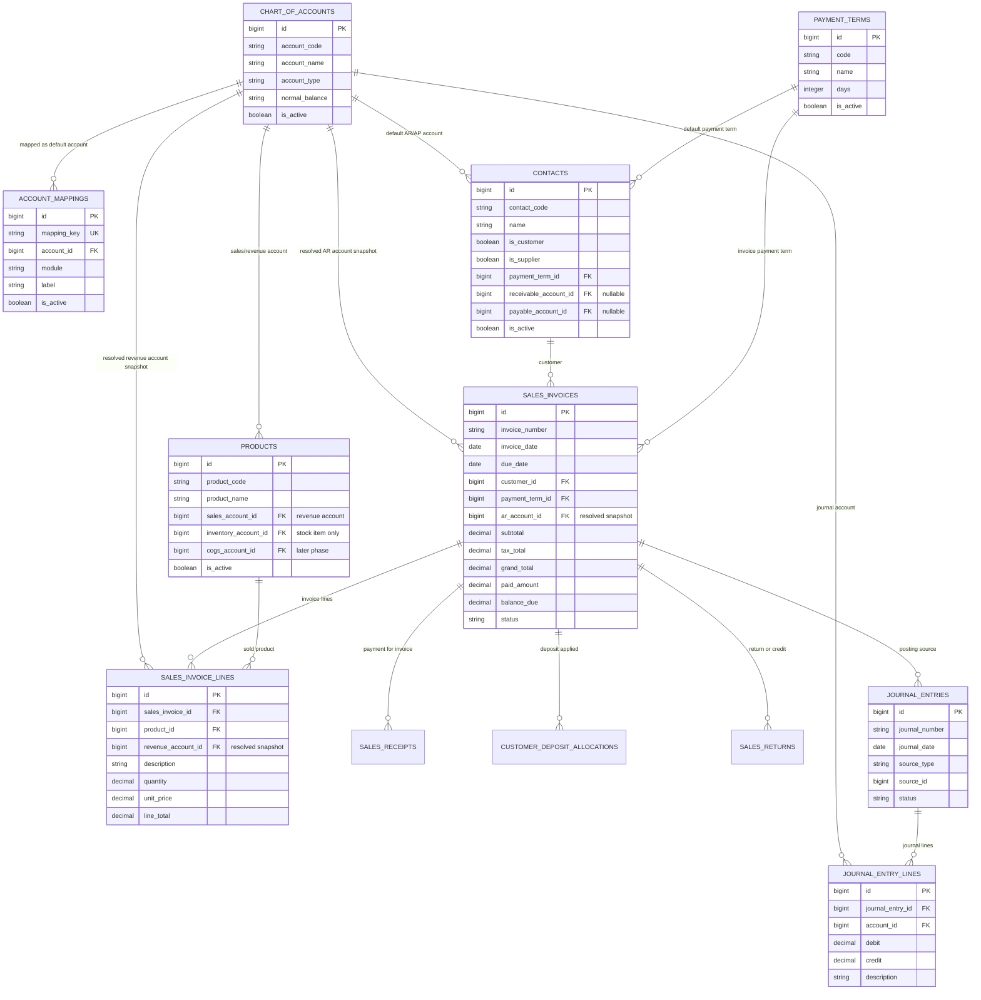

# ERD — AR Account Mapping ke Customer

Dokumen ini menjelaskan desain mapping **Akun Piutang Usaha / Accounts Receivable** pada modul Sales & AR.

Keputusan desain:

```text
Customer → boleh punya AR Account khusus
Product  → punya Revenue Account
Account Mapping → default fallback
Invoice → menyimpan snapshot akun final
Journal → dibuat dari snapshot invoice
```

---

## 1. ERD Mermaid



---

## 2. Account Mapping yang Dibutuhkan

```text
ACCOUNT_MAPPINGS
├── sales.accounts_receivable  → Piutang Usaha default
├── sales.sales_revenue        → Pendapatan Penjualan default
├── sales.output_tax           → PPN Keluaran
├── sales.customer_deposit     → Uang Muka Pelanggan
├── sales.sales_discount       → Diskon Penjualan
└── sales.sales_return         → Retur Penjualan
```

---

## 3. Relasi Customer ke AR Account

```text
CONTACTS / CUSTOMER
├── Customer umum
│   └── receivable_account_id = null
│       fallback ke sales.accounts_receivable
│
├── Customer corporate / khusus
│   └── receivable_account_id = akun piutang khusus
│
└── Customer internal
    └── receivable_account_id = akun piutang internal
```

---

## 4. Rule Resolve Akun Piutang

Saat Sales Invoice di-submit/post:

```text
1. Ambil customer dari sales_invoices.customer_id
2. Jika contacts.receivable_account_id ada:
      pakai itu sebagai AR account
3. Jika kosong:
      pakai account_mappings['sales.accounts_receivable']
4. Jika masih kosong:
      fallback legacy account_mappings['accounts_receivable']
5. Jika masih kosong:
      block submit/post
```

Pseudo flow:

```text
resolveARAccount(customer):
    if customer.receivable_account_id is not null:
        return customer.receivable_account_id

    if mapping exists 'sales.accounts_receivable':
        return mapping.account_id

    if mapping exists 'accounts_receivable':
        return mapping.account_id

    throw "Akun Piutang Usaha belum diatur"
```

---

## 5. Jurnal Sales Invoice

Contoh invoice Rp 16.000 tanpa pajak:

```text
Dr Piutang Usaha                      16.000
    Cr Penjualan LPG 3 Kg Demo         16.000
```

Sumber akun:

```text
Dr Piutang Usaha
→ dari contacts.receivable_account_id
→ fallback account_mappings['sales.accounts_receivable']

Cr Penjualan
→ dari products.sales_account_id / sales_invoice_lines.revenue_account_id
→ fallback account_mappings['sales.sales_revenue']
```

Contoh dengan PPN:

```text
Dr Piutang Usaha                      17.760
    Cr Penjualan                       16.000
    Cr PPN Keluaran                     1.760
```

---

## 6. Field Minimal yang Perlu Ditambahkan

### contacts

```text
contacts
├── receivable_account_id nullable FK chart_of_accounts.id
└── payable_account_id nullable FK chart_of_accounts.id
```

`payable_account_id` disiapkan sekalian untuk vendor/AP:

```text
Vendor Bill
Dr Beban/Persediaan
    Cr Hutang Usaha
```

Untuk vendor:

```text
contacts.payable_account_id
fallback purchase.accounts_payable
```

### sales_invoices

```text
sales_invoices
└── ar_account_id nullable FK chart_of_accounts.id
```

### sales_invoice_lines

```text
sales_invoice_lines
└── revenue_account_id nullable FK chart_of_accounts.id
```

---

## 7. Kenapa Invoice Perlu Snapshot Akun

Invoice sebaiknya menyimpan akun final yang dipakai:

```text
sales_invoices.ar_account_id
sales_invoice_lines.revenue_account_id
```

Tujuannya:

```text
[✓] Invoice lama tetap historis
[✓] Perubahan master customer tidak mengubah invoice lama
[✓] Perubahan produk tidak mengubah akun revenue invoice lama
[✓] Jurnal bisa dibuat ulang dari snapshot invoice yang sama
[✓] Audit lebih jelas
```

---

## 8. Kesimpulan Implementasi

```text
[✓] AR account tidak diambil dari Product
[✓] AR account tidak dipilih manual di form invoice untuk MVP
[✓] AR account boleh diset di Customer jika customer khusus
[✓] Jika customer tidak punya AR account, pakai Account Mapping default
[✓] Product hanya menentukan akun pendapatan/revenue
[✓] Invoice menyimpan snapshot akun final
[✓] Journal dibuat dari snapshot invoice
```
